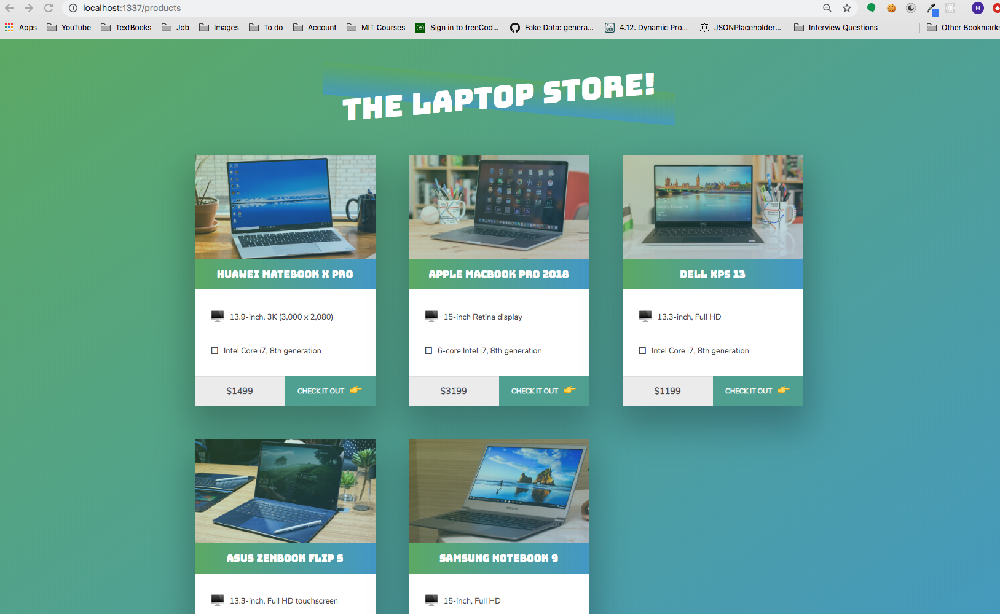
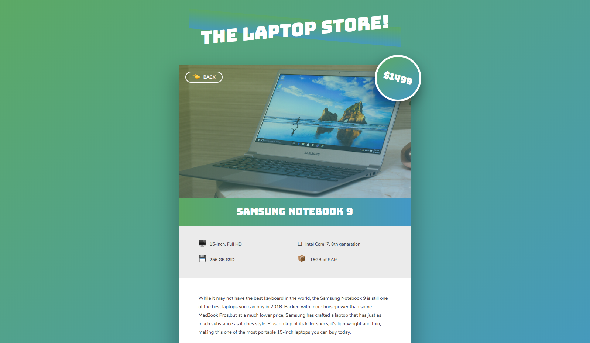

# The Laptop Store

This application is purely a demo of the Javascript, NodeJS, HTML, and CSS.
It was built to understand :
- How to read and parse JSON data file from the storage.
- How to set server and to communicate between server and browser.
- How to render a page including needed data.
- How to render images to the browser from server.
- How to navigate pages.

## Table of Contents
- [Getting Started](#getting-started)
- [App Preview](#app-preview)

## Getting Started

* [Download the installer](https://nodejs.org/) for Node.js 6 or greater.
* Clone this repository: `git clone https://github.com/Hogusong/LaptopStore.git`.
* Move to the project root.
* Run `node index.js` in a terminal from the project root.
* Open `localhost:1337` in your web browser.

_Note: See [How to Prevent Permissions Errors](https://docs.npmjs.com/getting-started/fixing-npm-permissions) if you are running into issues when trying to install packages globally._

## App Preview

- Products Room

  

- Selected Laptop

  
